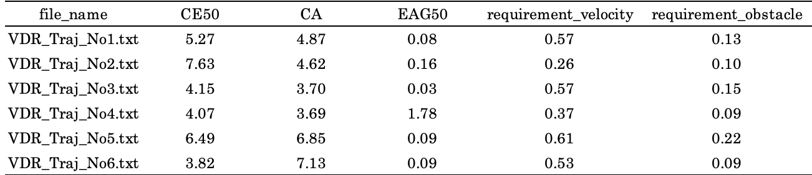
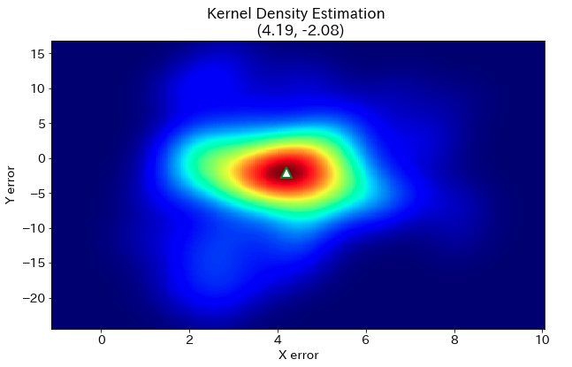
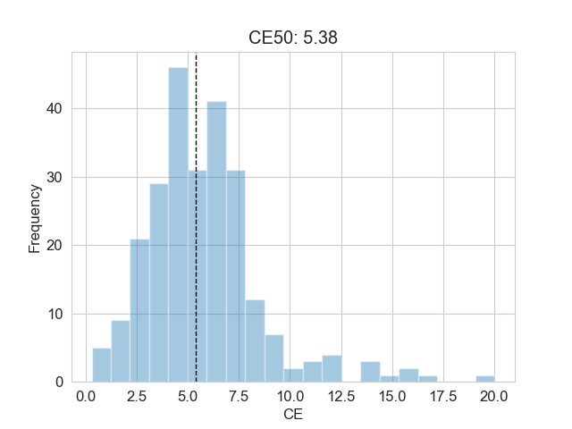
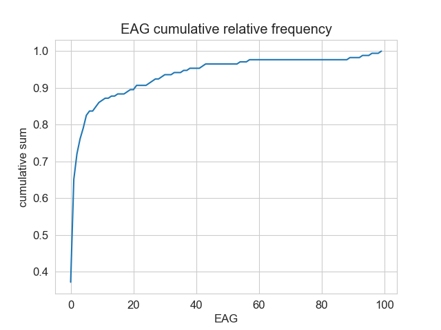
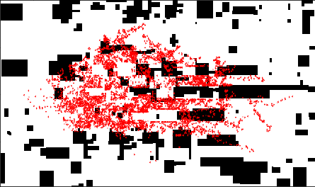

<div align="left">
<a href=https://www.facebook.com/pdr.bms/>
</div>

#  LTS-benchmark-tool
[日本語版(Japanese) README](README_JP.md)  
People who are involved in indoor positioning technology can calculate their estimation's indicator and requirement for xDR-based LTS.  
Indicator means evaluation value that is generally used for xDR-based LTS and requirement means validity that thajection is natural for real human behavior.  
You can calculate indicator and requiremet for demo estimation file and see how evaluation tool work.  
This evaluation tool has functions for saving indicator and requirement as csv and draw the histgrams and error deviation.  
This tool support following indicator and requirement.

| **Indcicator**           | **Description**    |
 ---                     |---                                       
| Circular Error (CE)                          | The distance between the ground-truth position and trajection position.|
| Circular Accuracy (CA)                       | The distance between the mode coordinates of the error XY distribution and origin (0, 0).| 
| Error Accumulation Gradient (EAG)            | The speed of error between trajection points and the correction points.|

| **Requirement**           | **Description**  |
 ---                     |---                    
| Requirement for Moving Velocity              | Check for trajection points velocity is within human walking speed (15 m/s) or not. The result in stdout is average velocity.|
| Requirement for Obstacle Avoidance           | Check for trajection points on map is the area that human cannot enter or not. The result in stdout is the ratio of coordinate where obstacle exists for total corrdinates. |


## Example of Evaluation Result 
<div align="cenetr">

</div>




## Requirement
```
python==3.6.10  
numpy==1.18.1  
pandas==1.0.1  
texttable==1.6.2  
tqdm==4.43.0  
opencv-python==4.2.0.34  
matplotlib==3.1.3 
scipy==1.4.1
seaborn==0.10.1  
```

## Description of Files

| **Filename**           | **Description**                                            |
 ---                     |---                                       
| demo_groud_truth       | Demo ground truth files for evaluation. data strucure config shoud be placed here.|
| demo_estimation        | Demo estimation files for evaluation. PDR and VDR directory should be sub directory.|
| main.py                | Execute evaluation script for indicator.                    | 
| indicator_evaluation.py| Module for calculating indicators.                          |
| dataloader.py          | Module for loading files.                                   |
| indicator_utils.py     | Specific functions to process indicators.                   |
| utils.py               | General functions to create result directory, stdout result.|
| demo_area_weights.ini  | Demo estimation's area weights.                             |
| requirements.txt       | Python library package version.                             |

## Usage
### Step.1 Install
```
git clone https://github.com/PDR-benchmark-standardization-committee/LTS-benchmark-tool
cd  LTS-benchmark-tool
pip install -r requirements.txt
```

### Step.2 Place estimation files
Place each track's estimation files at [estimatiion_folder]/PDR and [estimation_folder]/VDR respectively.  
If you want to evaluate demo estimation files, you don't need to prepare estimation files.
```
 LTS-benchmark-tool/
    ├ estimation_folder (demo_estimation)/
    │       └ VDR/[**VDR esimation files**]
    │       └ PDR/[**PDR estimation files**]
    │
    ├ groud_truth_folder (demo_ground_truth)/
    │       └ [**data config ini file**]
    │
    ├ main.py
    ├ indicator_evaluation.py
    ├ indicator_utils.py
    ├ utils.py
    ├ dataloader.py
    ├ demo_area_weights.ini
    ├ requirements.txt
    └ README.md
```
### Step.3 Place directory structure configuration 
You need to prepare configuration file that correspond to ground truth folder to evaluate.  
If you want to use your own groud truth file, please edit [demo_ground_truth/demo_data_config.ini] and place at groud truth folder.  
```
; Folder name of answer data
[ANSWER]
ground_truth_dname = 'demo_ground_truth'

[PDR]
; Folder name of ground truth files for evaluation
map_dname = 'PDR_Map'
ans_dname = 'PDR_Ans'
ref_dname = 'PDR_Ref'
bup_dname = 'PDR_Bup'

; File name of ground truth files for evaluation
map_image_fname = 'Map_image.bmp'
map_size_fname = 'Map_size.csv'
area_fname = 'Area.csv'
ref_fname = 'PDR_Ref_No{}.csv'
ans_fname = 'PDR_Ans_No{}.csv'
bup_info_fname = 'PDR_Bup_info_No{}.csv'

[VDR]
; Please write folder and file name for evaluation as [PDR]
```
If you want to evaluate demo estimation files, demo groud truth configuration file is already prepared.   
So you don't need edit configuration file, just go forward next step.

### Step.4 Evaluation

Estimation and gorund truth folder path are required for command line argument.
```
python main.py [estimation_path] [ground_truth_path]
```
If you want evaluate demo estimation files, please execute following script.  
```
python main.py demo_estimation demo_ground_truth
```

Indicators results are saved at estimation files folder.  
See the resut in demo_estimation folder
```
demo_estimation/
  └ VDR/
    └ results/
       └ indicator/
          ├ CE
          ├ CA
          ├ EGG
          ├ requirement_velocity
          └ requirement_obstacle
```

## Opptional Arguments
You can use opptional command line arguments below.  

### 1. Select track
You can select track to calculate indicator.   
In default, both VDR and PDR's indicator ande requirement are calculated.
```
python main.py demo_estimation demo_ground_truth --VDR --PDR
```

### 2. Select files
You can select specific estimatin file you want to evaluate.  
If you execute bellow script, [demo_estimation/VDR/VDR_Traj_No2.txt] indicator and requirement are evaluated.
```
python main.py demo_estimation demo_ground_truth --VDR --file VDR_Traj_No2.txt 
```

### 3. Select indicator
You can choose indicator and requirement to calculate.  
In default, all indicator and requirement are calculated.  

```
python main.py demo_estimation demo_ground_truth --CE --CA --EAG --requirement_velocity --requirement_obstacle  
```

### 4. Select parameters
You can select percentile to calculate for CE and EAG.  
In default, 50 percentile is calculated.  
```
python main.py demo_estimation demo_ground_truth --CE_percentile 30 --EAG_percentile 75
```

You can select velocity (default 1.5 m/s) for requirement fo moving velocity.  
```
python main.py demo_estimation demo_ground_truth --velocity 1.8
```

You can select band width to calculate CA by Kernel Density Estimation.  
If you do not select band_width, scipy default band width is used.  
```
python main.py demo_estimation demo_ground_truth --band_width 1.4
```

In default, CA is caluculated by Kernel Density Estimation, you can switch to use 2D histgram.    
```
python main.py demo_estimation demo_ground_truth --CA_hist
```

### 5. Use pre-defined area weights
You can use pre-defined area weights to calculate CA.  
You need to prepare area weights configuration ini file.  
Please see configuration format at [demo_area_weights.ini].  
If you do not select area weights configuration file path,  
area weights are set as the ratio of each area's answer points for total area answer points.  
```
; demo_area_weights.ini
[VDR]
area1 = 0.3
area2 = 0.3
area3 = 0.4

[PDR]
area1 = 0.4
area2 = 0.6
```
Please select area weigths configuration path
```
python main.py demo_estimation demo_ground_truth --area_weights demo_area_weights.ini
```


## Example of Result
You can run evaluation tool and see the actual results by using demo estimation data.  
Evaluation results are saved at [demo_estimation/VDR/result/indicator].  
VDR_Traj_No2.txt  
  

```                                                 
(python36) $ python main.py demo_estimation demo_ground_truth --VDR
track:['VDR'], indicators:['CE', 'CA', 'EAG', 'requirement_velocity', 'requirement_validity']
VDR_Traj_No1.txt evaluation progress...
100%|███████████████████████████████████████████████| 9006/9006 [00:03<00:00, 2985.56it/s]
VDR_Traj_No2.txt evaluation progress...
100%|███████████████████████████████████████████████| 7868/7868 [00:01<00:00, 4296.64it/s]
VDR_Traj_No3.txt evaluation progress...
100%|███████████████████████████████████████████████| 8957/8957 [00:02<00:00, 3021.12it/s]
VDR_Traj_No4.txt evaluation progress...
100%|███████████████████████████████████████████████| 7716/7716 [00:01<00:00, 3944.98it/s]
VDR_Traj_No5.txt evaluation progress...
100%|███████████████████████████████████████████████| 9054/9054 [00:03<00:00, 2590.31it/s]
VDR_Traj_No6.txt evaluation progress...
100%|███████████████████████████████████████████████| 7718/7718 [00:02<00:00, 3803.58it/s]
-------- file indicator --------
   file_name       CE50     CA     EAG50   requirement_velocity   requirement_obstacle
======================================================================================
VDR_Traj_No1.txt   5.271   4.874   0.080          0.571                  0.133        
VDR_Traj_No2.txt   7.633   4.618   0.158          0.264                  0.098        
VDR_Traj_No3.txt   4.152   3.704   0.029          0.568                  0.150        
VDR_Traj_No4.txt   4.071   3.693   1.780          0.365                  0.085        
VDR_Traj_No5.txt   6.488   6.854   0.087          0.611                  0.221        
VDR_Traj_No6.txt   3.819   7.129   0.091          0.529                  0.086         

-------- total indicator --------
CE50     CA     EAG50   requirement_velocity   requirement_obstacle
===================================================================
5.239   5.145   0.371          0.484                  0.129         
```

## Licence
Copyright (c) 2020 Satsuki Nagae and PDR benchmark standardization committee.  
LTS-benchmark-tool is open source software under the [MIT license](LICENSE).  

## Reference 
- [xDR Challenge in industrial Scenario in 2020](https://unit.aist.go.jp/harc/xDR-Challenge-2020/)  
- [Ryosuke Ichikari, Katsuhiko Kaji, Ryo Shimomura, Masakatsu Kourogi, Takashi Okuma, Takeshi Kurata: Off-Site Indoor Localization Competitions Based on Measured Data in a Warehouse, Sensors, vol. 19, issue 4, article 763, 2019.](https://www.mdpi.com/1424-8220/19/4/763/htm#)
