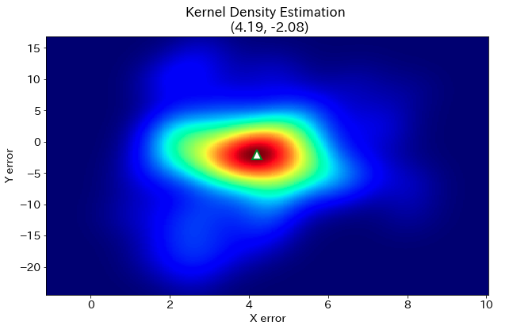
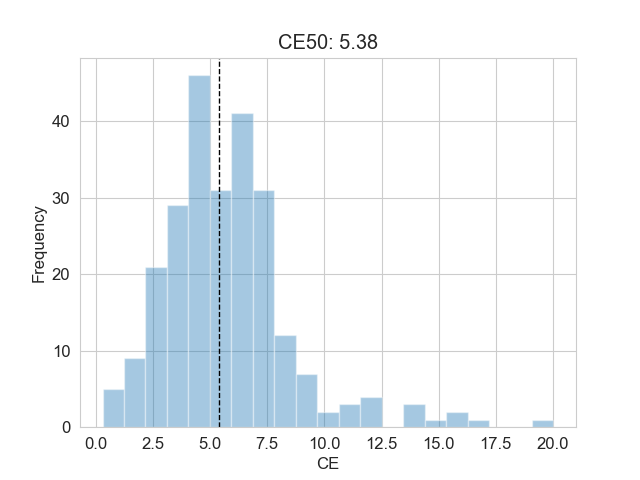
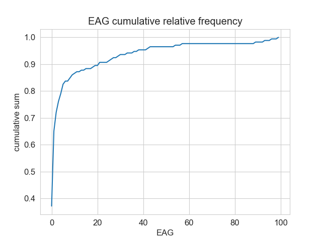

<div align="left">
<a href=https://www.facebook.com/pdr.bms/>
</a>
</div>

# LTS-benchmark-tool
屋内測位業務に関わる人を対象とした、xDR-based LTS (Localization and Tracking Systems)での測位結果の評価指標と必要条件を計算するツール。  
指標はxDR-based LTSの汎用的な評価のために用いられる値で      
必要条件は推定軌跡が現実の人間の挙動に即した軌跡となっているかを評価した値となります。  
本ツールは、ご自身の推定ファイルと正解値データがなくても、デモ用の推定軌跡ファイルと正解値ファイルを用いて、  
ツールの実行結果の様子を手元で確認することが可能となっています。  
ご自身で用意した推定軌跡と正解値データを用いて評価を行う場合、データ読み込みのための設定ファイルが必要となりますので使用方法Step3でご確認ください。  
本ツールでは、指標と必要条件の計算機能、ヒストグラムや誤差分布を可視化する機能が備わっています。  
以下が本ツールで評価可能となっている指標と必要条件の概要になります。

| **指標**           | **概要**    |
 ---                     |---                                       
| 誤差絶対量: CE (Circular Error)                 | 正解座標データ(2次元)と時間的最近傍の軌跡の(2次元)ユークリッド距離                      |
| 誤差分布偏移: CA (Circular Accuracy)            | 誤差XY分布の最頻値座標と誤差原点(0, 0)までの距離                                        | 
| 誤差累積勾配: EAG (Error Accumulation Gradient) | ALIP内の評価点と時間的最近傍の座標公開点(ALIP境界)との時間差に対する誤差絶対量の割合|

| **必要条件**           | **概要**    |
 ---                     |---                    
| 移動速度基準: Requirement for Moving Velocity    | 測位軌跡を構成する構成点の局所的な歩行速度が歩行者速度基準閾値(1.5 m/s)以下かを確認|
| 軌跡経路基準: Requirement for Obstacle Avoidance | 測位軌跡が歩行可能なエリアを通るかを確認|

ALIP (Absolute-Localization Inapplicable Period): Bluetooth信号なしで測位を行った期間 

## 評価結果例
推定軌跡ごとの指標を一覧で取得することができ、  
誤差絶対量(CE)、誤差累積勾配(EAG)の分布、誤差分布偏移(CA)の描画を行うことができます。
<div align="cenetr">

</div>





## 必要要件
```
python==3.6.10  
numpy==1.18.1  
pandas==1.0.1  
texttable==1.6.2  
tqdm==4.43.0  
opencv-python==4.2.0.34  
matplotlib==3.1.3 
scipy==1.4.1
seaborn==0.10.1  
```

## ファイル概要

| **ファイル名**           | **概要**                                                              |
 ---                     |---                                        
| main.py                | 評価実行用スクリプト                                                    |
| indicator_evaluation.py| 指標計算モジュール                                                      |
| dataloader.py          | 正解データ, 推定軌跡読み込みモジュール                                  |
| indicator_utils.py     | 指標を扱うための関数をまとめたスクリプト                                |
| utils.py               | フォルダ作成、結果出力など汎用的な処理をまとめたスクリプト              | 
| demo_area_weights.ini  | デモ推定軌跡用のエリア重み設定ファイル                                  |
| requirements.txt       | Pythonの必要ライブラリのバージョンをまとめたファイル                    |

## 使用方法
### Step.1 インストール
```
git clone LTS-benchmark-tool
cd LTS-benchmark-tool
pip install -r requirements.txt
```

### Step.2 推定ファイルを配置
PDR, VDRの推定軌跡ファイルをそれぞれ[estimatiion_folder]/PDR, [estimation_folder]/VDRに配置してください。  
デモデータの評価を行いたい場合、ご自身の推定軌跡ファイルを用意する必要はありません。  
```
LTS-benchmark-tool/
    ├ estimation_folder/
    │       └ VDR/
    |         └ VDR_Traj_No*.txt [**VDR estimation files**]
    │       └ PDR/
    |         └ PDR_Traj_No*.txt [**PDR estimation files**]
    │
    ├ groud_truth_folder/
    |       ├ BLE_Beacon/
    |       |  └ BLE_info.csv
    |       |
    |       ├ VDR_ALIP/
    |       |  └ VDR_ALIP_info_No*.csv
    |       |
    |       ├ VDR_Ans/
    |       |  └ VDR_Ans_No*.csv
    |       |
    |       ├ VDR_Map/
    |       |  ├ Map_image.bmp
    |       |  ├ Map_size.csv
    |       |  └ VDR_Area.csv
    |       |
    |       ├ VDR_Module/
    |       |  └ VDR_Sens_No*.txt
    |       |
    |       ├ VDR_Ref/
    |       |  └ VDR_Ref_No*.csv
    |       |
    |       ├ PDR_ALIP/
    |       |  └ PDR_ALIP_info_No*.csv
    |       |
    |       ├ PDR_Ans/
    |       |  └ PDR_Ans_No*.csv
    |       |
    |       ├ PDR_Map/
    |       |  ├ Map_image.bmp
    |       |  ├ Map_size.csv
    |       |  └ PDR_Area.csv
    |       |
    |       ├ PDR_Module/
    |       |  └ PDR_Sens_No*.txt
    |       |
    |       ├ PDR_Ref/
    |       |  └ PDR_Ref_No*.csv
    |       |
    │       └ data_config.ini
    │
    ├ main.py
    ├ indicator_evaluation.py
    ├ indicator_utils.py
    ├ utils.py
    ├ dataloader.py
    ├ demo_area_weights.ini
    ├ requirements.txt
    └ README.md
```
#### VDR_Traj_No*.txt, PDR_Traj_No*.txtの構成
軌跡ファイルの中身はカンマ区切りで以下のような構成となります。  
※軌跡ファイル内にヘッダーは含みません。  
| unixtime | x[m] | y[m] |
|---       |---   |---   |

### Step.3 正解値データのディレクリ構造を記載した設定ファイルを用意
正解データを読み込むために、正解値データのディレクトリ名、  
ファイル名を記載した設定ファイルを準備する必要があります。  
ご自身の用意した正解データを利用する際は、ground_truth_folderのフォルダにあるdata_config.iniファイルを  
ご自身の正解データに合わせて修正し、正解データのディレクトリに配置してください。  
以下のような設定ファイルをご自身の正解値データに合わせて作成してください。  
```
; 正解値データフォルダ名
[ANSWER]
ground_truth_dname = 'groud_truth_folder'

[PDR]
; 各評価用データのディレクトリ名
map_dname = 'PDR_Map'
ans_dname = 'PDR_Ans'
ref_dname = 'PDR_Ref'
ALIP_dname = 'PDR_ALIP'
BLE_dname = 'BLE_Beacon'

; 各評価用データのファイル名
map_image_fname = 'Map_image.bmp'
map_size_fname = 'Map_size.csv'
area_fname = 'PDR_Area.csv'
ref_fname = 'PDR_Ref_No{}.csv'
ans_fname = 'PDR_Ans_No{}.csv'
ALIP_info_fname = 'PDR_ALIP_info_No{}.csv'
BLE_info_fname = 'BLE_info.csv'

; 描画軌跡の色設定
map_obstacle_color = 'gray'
map_trajectory_color = 'green'
map_ref_color = 'orange'
map_ble_color = 'blue'

; 描画軌跡の表示サイズ設定
map_trajectory_size = '0.2'
map_ref_size = '0.3'
map_ble_size = '2'
map_grid = 'False'

[VDR]
; PDRと同様にディレクトリ名・ファイル名を記載
```

デモデータの評価を行いたい場合、設定ファイルが既にデモ用正解値データのフォルダ内に配置されていますので、  
設定ファイルを用意する必要はありません。  

### Step.4 評価の実行

評価を行う推定軌跡と正解データのフォルダのパスをコマンドライン引数に入力する必要があります。
```
python main.py [estimation_path] [ground_truth_path]
```
デモデータの評価を実行したい場合は、以下のスクリプトを実行してください
```
python main.py estimation_folder groud_truth_folder
```

指標と必要条件の評価結果が推定軌跡のフォルダ内に保存されます。  
デモデータの評価を行った場合、以下のパスに結果が保存されます。
```
estimation_folder/
  | VDR/
  | └ result/
  |    └ indicator
  |      ├ CA
  |      | ├ Traj_No*_area*_CA.png
  |      | └ Traj_No*_CA.csv
  |      |
  |      ├ CE
  |      | ├ CE_total_cumulative_sum.csv
  |      | ├ CE_total_cumulative_sum.png
  |      | ├ CE_total_histgram.png
  |      | ├ Traj_No*_CE.csv
  |      | ├ Traj_No*_CE_debug.csv
  |      | └ Traj_No*_CE_histgram.png
  |      |
  |      ├ EAG
  |      | ├ EAG_total_cumulative_sum.csv
  |      | ├ EAG_total_cumulative_sum.png
  |      | ├ EAG_total_histgram.png
  |      | ├ Traj_No*_EAG.csv
  |      | ├ Traj_No*_EAG_debug.csv
  |      | └ Traj_No*_EAG_histgram.png
  |      |
  |      ├ requirement_obstacle
  |      | └ Traj_No*_obstacle.csv
  |      |
  |      ├ requirement_velocity
  |      | └ Traj_No*_moving_velocity.csv
  |      |
  |      ├ Trajectory
  |      | └ Tra_No*.png
  |      |
  |      ├ file_indicator.csv
  |      └ total_indicator.csv
  | 
  └ PDR/
    └result/ [***Almost the same as VDR result folder***]
```

## コマンドライン引数
以下のコマンドライン引数を追加することが可能となっています。

### 1. PDR, VDRの選択
PDR, VDR、どちらの評価を行うか選択することができます。  
引数なしの場合は、PDR, VDR両方とも評価されます。
```
python main.py estimation_folder groud_truth_folder --VDR --PDR
```

### 2. 評価するファイルを選択
特定の軌跡ファイルを指定して、評価するファイルを選択することができます。  
例えば、以下のようなコマンドライン引数で実行した場合、  
[estimation_folder/VDR/VDR_Traj_No1.txt]の評価が実行されます。
```
python main.py estimation_folder groud_truth_folder --VDR --file VDR_Traj_No1.txt 
```

### 3. 計算する指標・必要条件の選択
計算を実行したい指標と必要条件を選択することができます。  
引数なしの場合は、全ての指標と必要条件の計算が実行されます  

```
python main.py estimation_folder groud_truth_folder --CE --CA --EAG --requirement_velocity --requirement_obstacle  
```

### 4. パラメータの選択

CE, EAGで計算するパーセント点を指定することができます。  
引数なしの場合は50パーセント点の値が計算されます。  
以下の場合、CEの30パーセント点、EAGの75パーセント点が計算されます。
```
python main.py estimation_folder groud_truth_folder --CE_percentile 30 --EAG_percentile 75
```

移動速度基準で用いられる速度しきい値を指定することができます。  
引数なしの場合は、1.5 m/s がしきい値として用いられます。
```
python main.py estimation_folder groud_truth_folder --velocity 1.8
```

CAの計算でのカーネル密度推定のバンド幅を指定することができます。  
バンド幅の指定がない場合は、sciのデフォルトのバンド幅が用いられます。  
```
python main.py estimation_folder groud_truth_folder --band_width 1.4
```

CAの計算を二次元ヒストグラムで行うように切り替えることが可能となっています。  
引数なしの場合は、scipyのデフォルトパラメータのカーネル密度推定によってCAが計算されます  
```
python main.py estimation_folder groud_truth_folder --CA_hist
```

### 5. 事前に指定したエリア重みを使用する
CAの計算に用いるエリア重みに、ご自身で設定した値を指定することができます。  
その場合、エリア重みを記述した設定ファイルを用意する必要があります。  
エリア重みの設定ファイルを指定しなかった場合、  
各エリアに含まれる正解値の全正解値に対する割合が各エリアの重みとなります。  
エリア重みの設定ファイルはデモデータ用のエリア重み設定ファイルのように作成してください。  
```
; demo_area_weights.ini
[VDR]
area1 = 0.3
area2 = 0.3
area3 = 0.4

[PDR]
area1 = 0.4
area2 = 0.6
```

用意したエリア重みの設定ファイルのパスを指定してください。
```
python main.py demo_estimation demo_ground_truth --area_weights demo_area_weights.ini
```

## ライセンス
Copyright (c) 2020 Satsuki Nagae and PDR benchmark standardization committee.  
LTS-benchmark-tool is open source software under the [MIT license](LICENSE).  

## 参考文献
- [xDR Challenge in industrial Scenario in 2020](https://unit.aist.go.jp/harc/xDR-Challenge-2020/)  
- [Ryosuke Ichikari, Katsuhiko Kaji, Ryo Shimomura, Masakatsu Kourogi, Takashi Okuma, Takeshi Kurata: Off-Site Indoor Localization Competitions Based on Measured Data in a Warehouse, Sensors, vol. 19, issue 4, article 763, 2019.](https://www.mdpi.com/1424-8220/19/4/763/htm#)
